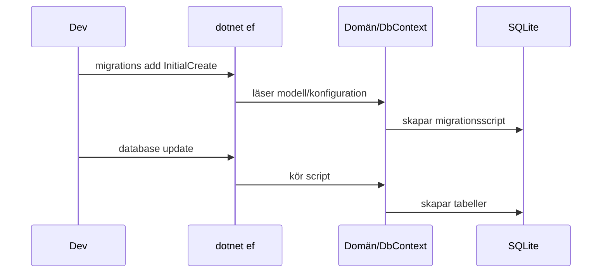

# Migrationer – skapa & uppdatera databas

## Mål
Skapa första migrationen och materialisera SQLite‑databas.

## Kommandon (kör i API‑/host‑projektet som refererar Infrastructure)
```bash
dotnet ef migrations add InitialCreate --project <InfrastructureProj> --startup-project <ApiProj>
dotnet ef database update --project <InfrastructureProj> --startup-project <ApiProj>
````

> Byt `<InfrastructureProj>` och `<ApiProj>` till era kataloger/proj‑filer.

## Förväntat resultat

*   Migrationsfiler genereras under Infrastructure
*   `quizbattle.db` skapas i host‑projektets utdata

## Vanliga fel

*   “No design‑time services” → installera `Microsoft.EntityFrameworkCore.Design`
*   “No parameterless constructor” → lägg till paramlös ctor i entiteter
*   “Unable to create an object of type …” → säkerställ `AddDbContext` och korrekt startup‑projekt

## Flöde



## Checklista

*   [ ] Migration skapad
*   [ ] Databas uppdaterad
*   [ ] Tabellerna finns (Questions/Choices/Answers)
